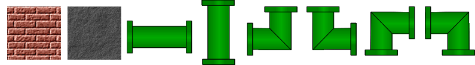
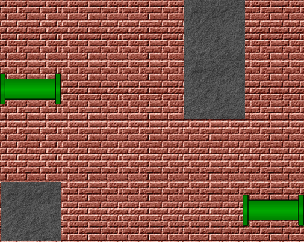
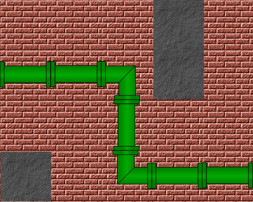
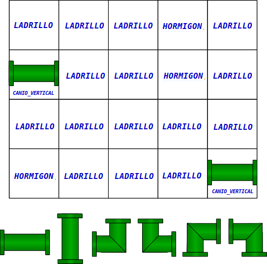

UNTREF - Algoritmos y Programación 1

# Trabajo Práctico: Plomero 

## Problema

Construir una cañería que interconecte dos caños localizados en los extremos laterales de una pared,
reemplazando exclusivamente labrillos.

### Materiales

### Ejemplo de Pared

### Ejemplo de Cañería

## Enunciado

Implementar la clase `Plomero` a partir de la siguiente especificación: [`Plomero.java`](./src/Plomero.java).

Enumerado `Material`: [`Material.java`](./src/Material.java)

### Ejemplo del array `pared`

## Condiciones

El siguiente trabajo corresponde al final para alumnos/as en condición de LIBRE. 
Debe realizarse forma individual y deberá ser defendido de manera oral.

La fecha límite de entrega del trabajo es: lunes 22 de febrero. 

Se proporciona una batería de pruebas básicas que su código deberá resolver.
 
Una vez que éstas pasen, deberán agregar más pruebas para considerar casos que no 
estén contemplados en la batería original.

Los docentes usarán su propia batería de pruebas (que respetan la misma interfaz, 
por lo que no deberán cambiar la firma de sus métodos).

## Pruebas Unitarias

Pruebas iniciales básicas con cañerías lineales y paredes completas: [`PruebaPlomeroPrincipiante.java`](./src/PruebaPlomeroPrincipiante.java)

Pruebas que contemplan algunas condiciones que rompen el contrato: [`PruebaPlomeroPrecavido.java`](./src/PruebaPlomeroPrecavido.java)

